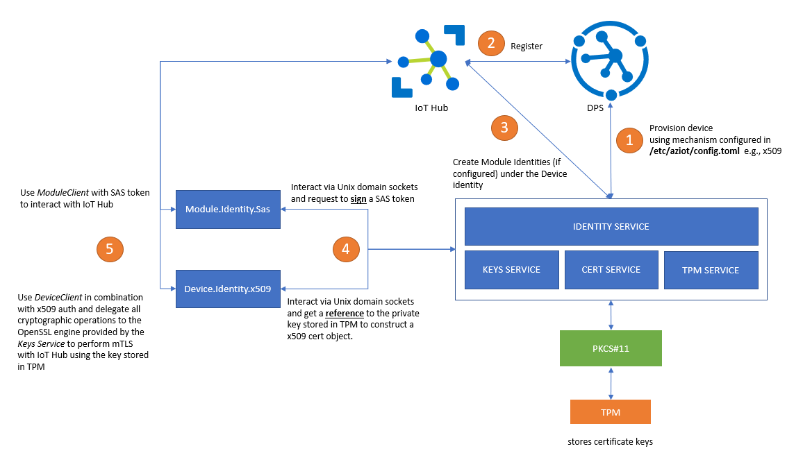

# Azure IoT Identity Service Integration

> **Disclaimer:** This repo DOES NOT contain production ready code (very limited error handling etc.) and only demonstrates the approach.

This repo demonstrates different options for integrating a custom IoT Agent with [Azure IoT Identity Service](https://azure.github.io/iot-identity-service/).  
While these samples are written in C# .NET 5, it is definetely possible to implement them using other programming languages. It basically comes down to being able to communicate over Unix domain sockets and potentially doing interop with the native OpenSSL library.  

Refer to [this documenation](https://azure.github.io/iot-identity-service/develop-an-agent.html) to understand concepts behind Azure IoT Identity Service.  
It is also important to understand [different identity types and available authnetication options](https://azure.github.io/iot-identity-service/develop-an-agent.html#connecting-your-agent-to-iot-hub).

## Setup
The implementation is tested on *Raspberry Pi 3 B+* with the [*Infineon Optiga SLB9670 TPM 2.0*](https://www.infineon.com/cms/en/product/security-smart-card-solutions/optiga-embedded-security-solutions/optiga-tpm/slb-9670vq2.0/)  
Azure IoT Edentity Service is configured to use PKCS#11 integration with this TPM chip and to request certificate through [EST](https://datatracker.ietf.org/doc/html/rfc7030). 
For details on how to configure this refer to [this repo](https://github.com/arlotito/iot-edge-1.2-tpm/blob/main/step-by-step.md).  



## Run it
To run these samples, you'll need to follow these steps:
- Setup your Cloud services (DPS and IoT Hub).
- [Install the Azure IoT Identity Service](https://azure.github.io/iot-identity-service/installation.html)
- [Configure it](https://azure.github.io/iot-identity-service/configuration.html). If you want to use it with an HSM and/or EST, refer to [this repo](https://github.com/arlotito/iot-edge-1.2-tpm/blob/main/step-by-step.md).
- [Authorize you client application](https://azure.github.io/iot-identity-service/develop-an-agent.html#client-authorization) so it can interact with the services through Unix domain sockets.
- Clone this repo and go into one of the project folders
- [Download and install .NET 5](https://dotnet.microsoft.com/download)
- Excecute ```dotnet run``` if you are the user whom the authorization is configured for OR run e.g. ```sudo -u <username> dotnet run``` if you are not.

## Module.Identity.Sas
This demonstrates how to implement a custom IoT agent using [module identities](https://docs.microsoft.com/en-us/azure/iot-hub/iot-hub-portal-csharp-module-twin-getstarted).  
Module identites are e.g. used for IoT Edge modules and are within the scope of a specific device. Module identities can also be used without IoT Edge on simple IoT devices. Module identities currently do not support x509 authentication, they only support **SAS authentiation scheme**.

## Device.Identity.x509
This demonstrates how to implement a custom IoT agent using device identities with x509 client cert based authentication (with keys potentially backed by an HSM). The important part here is that all  cryptographic operations are performed by the preconfigured OpenSSL engine which comes with the [Keys Service](https://azure.github.io/iot-identity-service/api/keys-service.html) (aka keyd). So if the Keys Service uses an HSM (e.g. TPM) to store the keys, all cryptographic operations will be performed by this HSM and private keys never see the light of day. Unfortunately .NET does not seem to support working with custom OpenSSL engines ([see the GitHub issue](https://github.com/dotnet/runtime/issues/37383)) which is why I needed to fallback to native interop with **libssl**.  

[This GitHub issue](https://github.com/Azure-Samples/azure-iot-samples-csharp/issues/61) was absolutely helpful to understand what needs to be done. 

> *Hint:*  
> - Depending on the CPU architecture the path to *libssl* might need to be adapted for [here](./Device.Identity.x509/NativeMethods.cs). The path can be found using ```ldconfig -p|grep ssl```  
> - Also one needs to make sure that the OpenSSL version used by .NET corresponds to the *SafeEvpPKeyHandle.OpenSslVersion*
